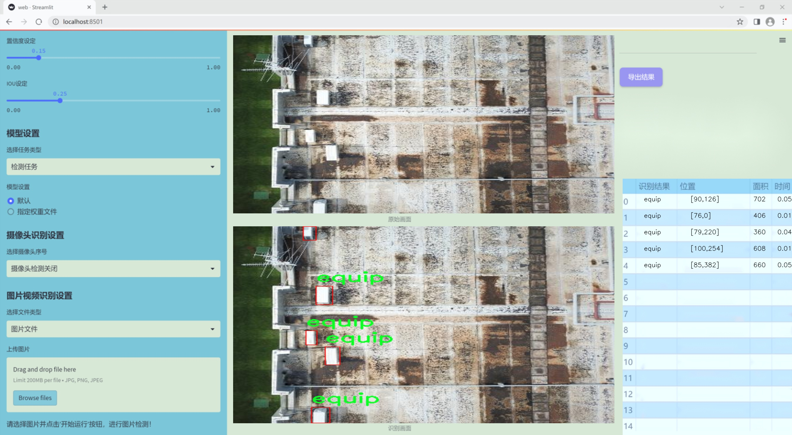
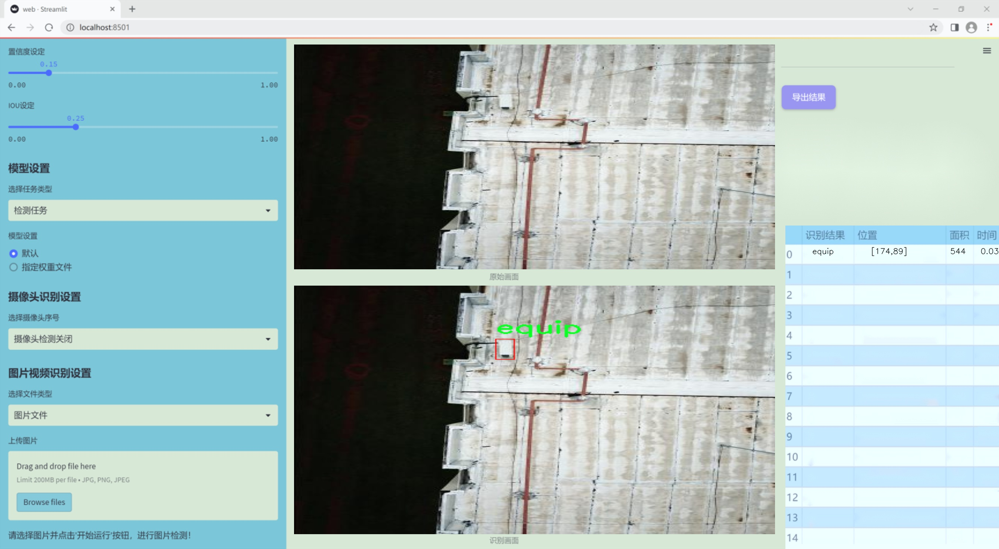
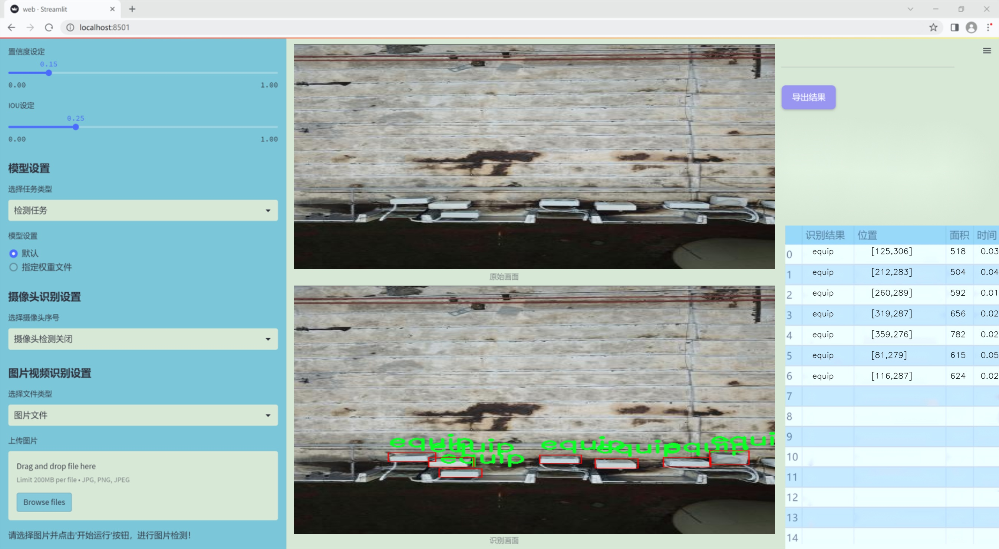
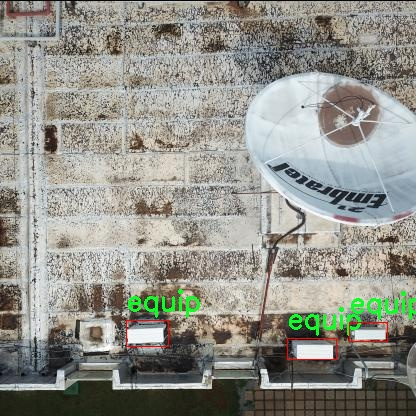
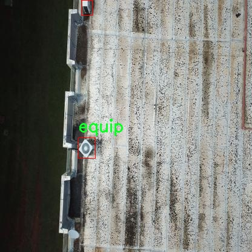
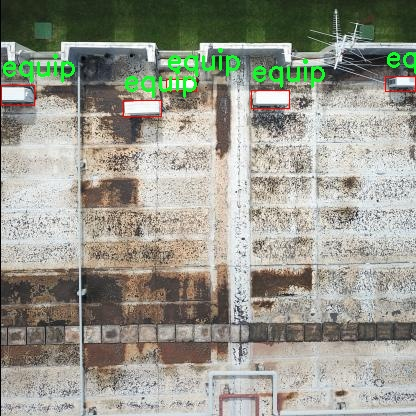
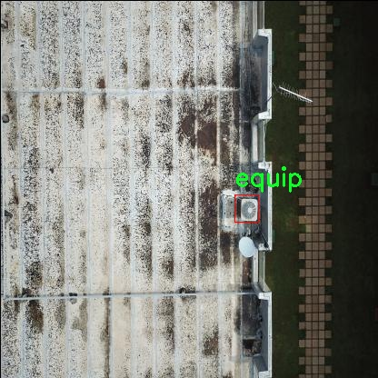
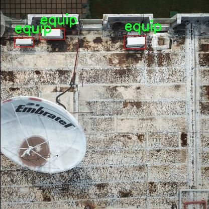

# 改进yolo11-ContextGuided等200+全套创新点大全：航拍图屋顶异常检测系统源码＆数据集全套

### 1.图片效果展示







##### 项目来源 **[人工智能促进会 2024.11.01](https://kdocs.cn/l/cszuIiCKVNis)**

注意：由于项目一直在更新迭代，上面“1.图片效果展示”和“2.视频效果展示”展示的系统图片或者视频可能为老版本，新版本在老版本的基础上升级如下：（实际效果以升级的新版本为准）

  （1）适配了YOLOV11的“目标检测”模型和“实例分割”模型，通过加载相应的权重（.pt）文件即可自适应加载模型。

  （2）支持“图片识别”、“视频识别”、“摄像头实时识别”三种识别模式。

  （3）支持“图片识别”、“视频识别”、“摄像头实时识别”三种识别结果保存导出，解决手动导出（容易卡顿出现爆内存）存在的问题，识别完自动保存结果并导出到tempDir中。

  （4）支持Web前端系统中的标题、背景图等自定义修改。

  另外本项目提供训练的数据集和训练教程,暂不提供权重文件（best.pt）,需要您按照教程进行训练后实现图片演示和Web前端界面演示的效果。

### 2.视频效果展示

[2.1 视频效果展示](https://www.bilibili.com/video/BV1x1DPYxELK/)

### 3.背景

研究背景与意义

随着城市化进程的加快，建筑物的数量不断增加，屋顶作为建筑的重要组成部分，其安全性和功能性日益受到关注。屋顶异常现象，如积水、锈蚀、裂缝等，不仅影响建筑物的美观，更可能导致结构性损害，进而影响居民的安全和生活质量。因此，及时有效地检测屋顶异常现象显得尤为重要。传统的屋顶检查方法通常依赖人工巡检，效率低下且容易受到天气、时间等因素的影响，无法实现实时监测和高效评估。

近年来，随着无人机技术的迅速发展，航拍图像的获取变得更加便捷和高效。结合深度学习技术，尤其是目标检测算法的应用，为屋顶异常检测提供了新的解决方案。YOLO（You Only Look Once）系列算法因其高效的实时检测能力而受到广泛关注。特别是YOLOv11的推出，进一步提升了目标检测的精度和速度。然而，现有的YOLOv11模型在特定领域的应用上仍存在一定的局限性，尤其是在处理复杂的屋顶异常检测任务时。

本研究旨在基于改进的YOLOv11模型，构建一个高效的航拍图屋顶异常检测系统。通过对现有数据集的深入分析，我们将聚焦于屋顶异常的多种类型，包括排水口有无、设备存在、裂缝、积水等情况。数据集中包含76幅图像，涵盖了多种异常类型，能够为模型的训练和测试提供丰富的样本。通过对模型的改进和优化，我们期望能够提高检测的准确性和鲁棒性，从而为建筑物的维护和管理提供科学依据。

综上所述，本研究不仅具有重要的理论意义，也将为实际应用提供切实可行的解决方案，推动建筑物屋顶检测技术的发展，为城市安全和可持续发展贡献力量。

### 4.数据集信息展示

##### 4.1 本项目数据集详细数据（类别数＆类别名）

nc: 1
names: ['equip']


该项目为【目标检测】数据集，请在【训练教程和Web端加载模型教程（第三步）】这一步的时候按照【目标检测】部分的教程来训练

##### 4.2 本项目数据集信息介绍

本项目数据集信息介绍

本项目所使用的数据集名为“Roof inspection anomalies”，旨在为改进YOLOv11的航拍图屋顶异常检测系统提供高质量的训练数据。该数据集专注于屋顶检查过程中可能出现的异常情况，尤其是与设备相关的异常。数据集中包含了一个类别，即“equip”，该类别涵盖了与屋顶设备相关的各种异常现象。这些异常可能包括设备的损坏、老化、错位等问题，这些问题在航拍图像中可能表现为特定的视觉特征。

“Roof inspection anomalies”数据集的构建过程注重数据的多样性和代表性，确保所收集的图像能够涵盖不同类型的屋顶、不同的天气条件以及不同的拍摄角度。这种多样性使得模型在训练过程中能够学习到更为丰富的特征，从而提高其在实际应用中的鲁棒性和准确性。数据集中的图像均为高分辨率航拍图，能够清晰地展示屋顶的各个细节，便于模型识别和分类。

在数据标注方面，所有图像均经过专业人员的仔细标注，确保每个异常都被准确识别和标记。这种高质量的标注不仅提升了数据集的可靠性，也为后续的模型训练提供了坚实的基础。通过对“Roof inspection anomalies”数据集的深入分析和应用，我们期望能够显著提升YOLOv11在屋顶异常检测任务中的性能，推动航拍图像分析技术的发展，为建筑维护和安全检查提供更为有效的解决方案。











### 5.全套项目环境部署视频教程（零基础手把手教学）

[5.1 所需软件PyCharm和Anaconda安装教程（第一步）](https://www.bilibili.com/video/BV1BoC1YCEKi/?spm_id_from=333.999.0.0&vd_source=bc9aec86d164b67a7004b996143742dc)


[5.2 安装Python虚拟环境创建和依赖库安装视频教程（第二步）](https://www.bilibili.com/video/BV1ZoC1YCEBw?spm_id_from=333.788.videopod.sections&vd_source=bc9aec86d164b67a7004b996143742dc)

### 6.改进YOLOv11训练教程和Web_UI前端加载模型教程（零基础手把手教学）

[6.1 改进YOLOv11训练教程和Web_UI前端加载模型教程（第三步）](https://www.bilibili.com/video/BV1BoC1YCEhR?spm_id_from=333.788.videopod.sections&vd_source=bc9aec86d164b67a7004b996143742dc)


按照上面的训练视频教程链接加载项目提供的数据集，运行train.py即可开始训练



     Epoch   gpu_mem       box       obj       cls    labels  img_size
     1/200     20.8G   0.01576   0.01955  0.007536        22      1280: 100%|██████████| 849/849 [14:42<00:00,  1.04s/it]
               Class     Images     Labels          P          R     mAP@.5 mAP@.5:.95: 100%|██████████| 213/213 [01:14<00:00,  2.87it/s]
                 all       3395      17314      0.994      0.957      0.0957      0.0843

     Epoch   gpu_mem       box       obj       cls    labels  img_size
     2/200     20.8G   0.01578   0.01923  0.007006        22      1280: 100%|██████████| 849/849 [14:44<00:00,  1.04s/it]
               Class     Images     Labels          P          R     mAP@.5 mAP@.5:.95: 100%|██████████| 213/213 [01:12<00:00,  2.95it/s]
                 all       3395      17314      0.996      0.956      0.0957      0.0845

     Epoch   gpu_mem       box       obj       cls    labels  img_size
     3/200     20.8G   0.01561    0.0191  0.006895        27      1280: 100%|██████████| 849/849 [10:56<00:00,  1.29it/s]
               Class     Images     Labels          P          R     mAP@.5 mAP@.5:.95: 100%|███████   | 187/213 [00:52<00:00,  4.04it/s]
                 all       3395      17314      0.996      0.957      0.0957      0.0845


###### [项目数据集下载链接](https://kdocs.cn/l/cszuIiCKVNis)

### 7.原始YOLOv11算法讲解

YOLO11采用改进的骨干和颈部架构，增强了特征提取能力，提高了物体检测的精确度和复杂任务的表现。YOLO11引入精炼的架构设计和优化的训练流程，实现更快的处理速度，同时保持精度和性能之间的最佳平衡。通过模型设计的进步，YOLO11m在COCO数据集上实现了更高的均值平均精度（mAP），同时使用比YOLOv8m少22%的参数，使其在不妥协准确性的情况下更加计算高效。YOLO11可以无缝部署在各种环境中，包括边缘设备、云平台以及支持NVIDIA
GPU的系统，确保最大灵活性。无论是物体检测、实例分割、图像分类、姿态估计，还是定向物体检测（OBB），YOLO11都旨在应对多样的计算机视觉挑战。


##### **Ultralytics YOLO11相比于之前版本的主要改进有哪些？**

Ultralytics YOLO11在其前身基础上引入了几项重要进步。主要改进包括：

  1. **增强的特征提取** ：YOLO11采用改进的骨干和颈部架构，增强了特征提取能力，提高了物体检测的精确度。
  2.  **优化的效率和速度** ：精炼的架构设计和优化的训练流程实现了更快的处理速度，同时保持了准确性和性能之间的平衡。
  3.  **更高的准确性与更少的参数** ：YOLO11m在COCO数据集上实现了更高的均值平均精度（mAP），同时使用比YOLOv8m少22%的参数，使其在不妥协准确性的情况下更加计算高效。
  4.  **环境适应性强** ：YOLO11可以在多种环境中部署，包括边缘设备、云平台以及支持NVIDIA GPU的系统。
  5.  **支持广泛的任务** ：YOLO11支持多种计算机视觉任务，如物体检测、实例分割、图像分类、姿态估计和定向物体检测（OBB）。

我们先来看一下其网络结构有什么变化，可以看出，相比较于YOLOv8模型，其将CF2模块改成C3K2，同时在SPPF模块后面添加了一个C2PSA模块，且将YOLOv10的head思想引入到YOLO11的head中，使用深度可分离的方法，减少冗余计算，提高效率。下面我们来详细看一下这两个模块的结构是怎么构成的，以及它们为什么要这样设计


##### C3K2的网络结构

从下面图中我们可以看到，C3K2模块其实就是C2F模块转变出来的，它代码中有一个设置，就是当c3k这个参数为FALSE的时候，C3K2模块就是C2F模块，也就是说它的Bottleneck是普通的Bottleneck；反之当它为true的时候，将Bottleneck模块替换成C3模块。


##### C2PSA的网络结构

` `C2PSA是对 `C2f` 模块的扩展，它结合了PSA(Pointwise Spatial
Attention)块，用于增强特征提取和注意力机制。通过在标准 `C2f` 模块中引入 PSA
块，C2PSA实现了更强大的注意力机制，从而提高了模型对重要特征的捕捉能力。


##### **C2f 模块回顾：**

**** C2f模块是一个更快的 CSP（Cross Stage Partial）瓶颈实现，它通过两个卷积层和多个 Bottleneck
块进行特征提取。相比传统的 CSPNet，C2f 优化了瓶颈层的结构，使得计算速度更快。在 C2f中，`cv1` 是第一个 1x1
卷积，用于减少通道数；`cv2` 是另一个 1x1 卷积，用于恢复输出通道数。而 `n` 是一个包含 Bottleneck 块的数量，用于提取特征。

##### **C2PSA 模块的增强** ：

**C2PSA** 扩展了 C2f，通过引入PSA( **Position-Sensitive Attention)**
，旨在通过多头注意力机制和前馈神经网络来增强特征提取能力。它可以选择性地添加残差结构（shortcut）以优化梯度传播和网络训练效果。同时，使用FFN
可以将输入特征映射到更高维的空间，捕获输入特征的复杂非线性关系，允许模型学习更丰富的特征表示。

##### head部分

YOLO11在head部分的cls分支上使用深度可分离卷积 ，具体代码如下，cv2边界框回归分支，cv3分类分支。

    
    
     self.cv2 = nn.ModuleList(
                nn.Sequential(Conv(x, c2, 3), Conv(c2, c2, 3), nn.Conv2d(c2, 4 * self.reg_max, 1)) for x in ch
            )
            self.cv3 = nn.ModuleList(
                nn.Sequential(
                    nn.Sequential(DWConv(x, x, 3), Conv(x, c3, 1)),
                    nn.Sequential(DWConv(c3, c3, 3), Conv(c3, c3, 1)),
                    nn.Conv2d(c3, self.nc, 1),
                )
                for x in ch
            )


### 8.200+种全套改进YOLOV11创新点原理讲解

#### 8.1 200+种全套改进YOLOV11创新点原理讲解大全

由于篇幅限制，每个创新点的具体原理讲解就不全部展开，具体见下列网址中的改进模块对应项目的技术原理博客网址【Blog】（创新点均为模块化搭建，原理适配YOLOv5~YOLOv11等各种版本）

[改进模块技术原理博客【Blog】网址链接](https://gitee.com/qunmasj/good)


#### 8.2 精选部分改进YOLOV11创新点原理讲解

###### 这里节选部分改进创新点展开原理讲解(完整的改进原理见上图和[改进模块技术原理博客链接](https://gitee.com/qunmasj/good)【如果此小节的图加载失败可以通过CSDN或者Github搜索该博客的标题访问原始博客，原始博客图片显示正常】


### YOLO-MS简介
实时目标检测，以YOLO系列为例，已在工业领域中找到重要应用，特别是在边缘设备（如无人机和机器人）中。与之前的目标检测器不同，实时目标检测器旨在在速度和准确性之间追求最佳平衡。为了实现这一目标，提出了大量的工作：从第一代DarkNet到CSPNet，再到最近的扩展ELAN，随着性能的快速增长，实时目标检测器的架构经历了巨大的变化。

尽管性能令人印象深刻，但在不同尺度上识别对象仍然是实时目标检测器面临的基本挑战。这促使作者设计了一个强大的编码器架构，用于学习具有表现力的多尺度特征表示。具体而言，作者从两个新的角度考虑为实时目标检测编码多尺度特征：

从局部视角出发，作者设计了一个具有简单而有效的分层特征融合策略的MS-Block。受到Res2Net的启发，作者在MS-Block中引入了多个分支来进行特征提取，但不同的是，作者使用了一个带有深度卷积的 Inverted Bottleneck Block块，以实现对大Kernel的高效利用。

从全局视角出发，作者提出随着网络加深逐渐增加卷积的Kernel-Size。作者在浅层使用小Kernel卷积来更高效地处理高分辨率特征。另一方面，在深层中，作者采用大Kernel卷积来捕捉广泛的信息。

基于以上设计原则，作者呈现了作者的实时目标检测器，称为YOLO-MS。为了评估作者的YOLO-MS的性能，作者在MS COCO数据集上进行了全面的实验。还提供了与其他最先进方法的定量比较，以展示作者方法的强大性能。如图1所示，YOLO-MS在计算性能平衡方面优于其他近期的实时目标检测器。


具体而言，YOLO-MS-XS在MS COCO上获得了43%+的AP得分，仅具有450万个可学习参数和8.7亿个FLOPs。YOLO-MS-S和YOLO-MS分别获得了46%+和51%+的AP，可学习参数分别为810万和2220万。此外，作者的工作还可以作为其他YOLO模型的即插即用模块。通常情况下，作者的方法可以将YOLOv11的AP从37%+显著提高到40%+，甚至还可以使用更少的参数和FLOPs。


#### Multi-Scale Building Block Design
CSP Block是一个基于阶段级梯度路径的网络，平衡了梯度组合和计算成本。它是广泛应用于YOLO系列的基本构建块。已经提出了几种变体，包括YOLOv4和YOLOv11中的原始版本，Scaled YOLOv4中的CSPVoVNet，YOLOv11中的ELAN，以及RTMDet中提出的大Kernel单元。作者在图2(a)和图2(b)中分别展示了原始CSP块和ELAN的结构。


上述实时检测器中被忽视的一个关键方面是如何在基本构建块中编码多尺度特征。其中一个强大的设计原则是Res2Net，它聚合了来自不同层次的特征以增强多尺度表示。然而，这一原则并没有充分探索大Kernel卷积的作用，而大Kernel卷积已经在基于CNN的视觉识别任务模型中证明有效。将大Kernel卷积纳入Res2Net的主要障碍在于它们引入的计算开销，因为构建块采用了标准卷积。在作者的方法中，作者提出用 Inverted Bottleneck Block替代标准的3 × 3卷积，以享受大Kernel卷积的好处。

基于前面的分析，作者提出了一个带有分层特征融合策略的全新Block，称为MS-Block，以增强实时目标检测器在提取多尺度特征时的能力，同时保持快速的推理速度。

MS-Block的具体结构如图2(c)所示。假设是输入特征。通过1×1卷积的转换后，X的通道维度增加到n*C。然后，作者将X分割成n个不同的组，表示为，其中。为了降低计算成本，作者选择n为3。

注意，除了之外，每个其他组都经过一个 Inverted Bottleneck Block层，用表示，其中k表示Kernel-Size，以获得。的数学表示如下：


根据这个公式，该博客的作者不将 Inverted Bottleneck Block层连接，使其作为跨阶段连接，并保留来自前面层的信息。最后，作者将所有分割连接在一起，并应用1×1卷积来在所有分割之间进行交互，每个分割都编码不同尺度的特征。当网络加深时，这个1×1卷积也用于调整通道数。

#### Heterogeneous Kernel Selection Protocol
除了构建块的设计外，作者还从宏观角度探讨了卷积的使用。之前的实时目标检测器在不同的编码器阶段采用了同质卷积（即具有相同Kernel-Size的卷积），但作者认为这不是提取多尺度语义信息的最佳选项。

在金字塔结构中，从检测器的浅阶段提取的高分辨率特征通常用于捕捉细粒度语义，将用于检测小目标。相反，来自网络较深阶段的低分辨率特征用于捕捉高级语义，将用于检测大目标。如果作者在所有阶段都采用统一的小Kernel卷积，深阶段的有效感受野（ERF）将受到限制，影响大目标的性能。在每个阶段中引入大Kernel卷积可以帮助解决这个问题。然而，具有大的ERF的大Kernel可以编码更广泛的区域，这增加了在小目标外部包含噪声信息的概率，并且降低了推理速度。

在这项工作中，作者建议在不同阶段中采用异构卷积，以帮助捕获更丰富的多尺度特征。具体来说，在编码器的第一个阶段中，作者采用最小Kernel卷积，而最大Kernel卷积位于最后一个阶段。随后，作者逐步增加中间阶段的Kernel-Size，使其与特征分辨率的增加保持一致。这种策略允许提取细粒度和粗粒度的语义信息，增强了编码器的多尺度特征表示能力。

正如图所示，作者将k的值分别分配给编码器中的浅阶段到深阶段，取值为3、5、7和9。作者将其称为异构Kernel选择（HKS）协议。


作者的HKS协议能够在深层中扩大感受野，而不会对浅层产生任何其他影响。此外，HKS不仅有助于编码更丰富的多尺度特征，还确保了高效的推理。

如表1所示，将大Kernel卷积应用于高分辨率特征会产生较高的计算开销。然而，作者的HKS协议在低分辨率特征上采用大Kernel卷积，从而与仅使用大Kernel卷积相比，大大降低了计算成本。


在实践中，作者经验性地发现，采用HKS协议的YOLO-MS的推理速度几乎与仅使用深度可分离的3 × 3卷积相同。

#### Architecture
如图所示，作者模型的Backbone由4个阶段组成，每个阶段后面跟随1个步长为2的3 × 3卷积进行下采样。在第3个阶段后，作者添加了1个SPP块，与RTMDet中一样。在作者的编码器上，作者使用PAFPN作为Neck来构建特征金字塔[31, 35]。它融合了从Backbone不同阶段提取的多尺度特征。Neck中使用的基本构建块也是作者的MS-Block，在其中使用3 × 3深度可分离卷积进行快速推理。

此外，为了在速度和准确性之间取得更好的平衡，作者将Backbone中多级特征的通道深度减半。作者提供了3个不同尺度的YOLO-MS变体，即YOLO-MS-XS、YOLO-MS-S和YOLO-MS。不同尺度的YOLO-MS的详细配置列在表2中。对于YOLO-MS的其他部分，作者将其保持与RTMDet相同。


### 9.系统功能展示

图9.1.系统支持检测结果表格显示

  图9.2.系统支持置信度和IOU阈值手动调节

  图9.3.系统支持自定义加载权重文件best.pt(需要你通过步骤5中训练获得)

  图9.4.系统支持摄像头实时识别

  图9.5.系统支持图片识别

  图9.6.系统支持视频识别

  图9.7.系统支持识别结果文件自动保存

  图9.8.系统支持Excel导出检测结果数据


### 10. YOLOv11核心改进源码讲解

#### 10.1 test_selective_scan_speed.py

以下是代码的核心部分，并附上详细的中文注释：

```python
import torch
import torch.nn.functional as F
from einops import rearrange

def build_selective_scan_fn(selective_scan_cuda: object = None, mode="mamba_ssm"):
    """
    构建选择性扫描函数，支持不同的模式。
    :param selective_scan_cuda: CUDA实现的选择性扫描函数
    :param mode: 选择的模式
    :return: 选择性扫描函数
    """
    
    class SelectiveScanFn(torch.autograd.Function):
        @staticmethod
        def forward(ctx, u, delta, A, B, C, D=None, z=None, delta_bias=None, delta_softplus=False, return_last_state=False):
            """
            前向传播函数
            :param ctx: 上下文对象，用于保存状态
            :param u: 输入张量
            :param delta: 增量张量
            :param A, B, C: 权重张量
            :param D: 可选的张量
            :param z: 可选的张量
            :param delta_bias: 可选的增量偏置
            :param delta_softplus: 是否使用softplus激活
            :param return_last_state: 是否返回最后状态
            :return: 输出张量或输出和最后状态
            """
            # 确保输入张量是连续的
            if u.stride(-1) != 1:
                u = u.contiguous()
            if delta.stride(-1) != 1:
                delta = delta.contiguous()
            if D is not None:
                D = D.contiguous()
            if B.stride(-1) != 1:
                B = B.contiguous()
            if C.stride(-1) != 1:
                C = C.contiguous()
            if z is not None and z.stride(-1) != 1:
                z = z.contiguous()

            # 调整B和C的维度
            if B.dim() == 3:
                B = rearrange(B, "b dstate l -> b 1 dstate l")
                ctx.squeeze_B = True
            if C.dim() == 3:
                C = rearrange(C, "b dstate l -> b 1 dstate l")
                ctx.squeeze_C = True

            # 检查输入形状的有效性
            assert u.shape[1] % (B.shape[1]) == 0 

            # 调用CUDA实现的前向函数
            out, x, *rest = selective_scan_cuda.fwd(u, delta, A, B, C, D, z, delta_bias, delta_softplus)

            # 保存必要的状态以用于反向传播
            ctx.save_for_backward(u, delta, A, B, C, D, z, delta_bias, x)

            last_state = x[:, :, -1, 1::2]  # 获取最后状态
            return out if not return_last_state else (out, last_state)

        @staticmethod
        def backward(ctx, dout):
            """
            反向传播函数
            :param ctx: 上下文对象
            :param dout: 上游梯度
            :return: 输入张量的梯度
            """
            u, delta, A, B, C, D, z, delta_bias, x = ctx.saved_tensors

            # 调用CUDA实现的反向函数
            du, ddelta, dA, dB, dC, dD, ddelta_bias, *rest = selective_scan_cuda.bwd(
                u, delta, A, B, C, D, z, delta_bias, dout, x, None, False
            )

            # 返回输入张量的梯度
            return (du, ddelta, dA, dB, dC, dD if D is not None else None, None, ddelta_bias if delta_bias is not None else None)

    def selective_scan_fn(u, delta, A, B, C, D=None, z=None, delta_bias=None, delta_softplus=False, return_last_state=False):
        """
        封装选择性扫描函数的调用
        """
        return SelectiveScanFn.apply(u, delta, A, B, C, D, z, delta_bias, delta_softplus, return_last_state)

    return selective_scan_fn

def selective_scan_ref(u, delta, A, B, C, D=None, z=None, delta_bias=None, delta_softplus=False, return_last_state=False):
    """
    选择性扫描的参考实现
    :param u: 输入张量
    :param delta: 增量张量
    :param A, B, C: 权重张量
    :param D: 可选的张量
    :param z: 可选的张量
    :param delta_bias: 可选的增量偏置
    :param delta_softplus: 是否使用softplus激活
    :param return_last_state: 是否返回最后状态
    :return: 输出张量或输出和最后状态
    """
    # 将输入转换为浮点数
    u = u.float()
    delta = delta.float()
    if delta_bias is not None:
        delta = delta + delta_bias[..., None].float()
    if delta_softplus:
        delta = F.softplus(delta)

    # 初始化状态
    batch, dim, dstate = u.shape[0], A.shape[0], A.shape[1]
    x = A.new_zeros((batch, dim, dstate))
    ys = []

    # 计算增量和权重的乘积
    deltaA = torch.exp(torch.einsum('bdl,dn->bdln', delta, A))
    deltaB_u = torch.einsum('bdl,dn,bdl->bdln', delta, B, u)

    # 进行选择性扫描
    for i in range(u.shape[2]):
        x = deltaA[:, :, i] * x + deltaB_u[:, :, i]
        y = torch.einsum('bdn,dn->bd', x, C)
        ys.append(y)

    # 将结果堆叠成张量
    y = torch.stack(ys, dim=2)  # (batch dim L)
    out = y if D is None else y + u * rearrange(D, "d -> d 1")
    if z is not None:
        out = out * F.silu(z)

    return out if not return_last_state else (out, x)

# 其他函数如selective_scan_easy和test_speed可以根据需要保留或删除
```

### 代码说明：
1. **build_selective_scan_fn**: 构建选择性扫描函数，支持不同的模式。内部定义了`SelectiveScanFn`类，包含前向和反向传播的实现。
2. **forward**: 实现前向传播，处理输入的连续性，调用CUDA实现的前向函数，并保存必要的状态以供反向传播使用。
3. **backward**: 实现反向传播，调用CUDA实现的反向函数，返回输入张量的梯度。
4. **selective_scan_ref**: 参考实现的选择性扫描，使用PyTorch的基本操作实现，适用于不使用CUDA的情况。

以上是代码的核心部分和详细注释，其他函数可以根据具体需求进行选择性保留。

这个文件 `test_selective_scan_speed.py` 主要是用来测试和评估选择性扫描（Selective Scan）算法的速度和性能。代码中包含了多个函数和类，主要分为几个部分。

首先，文件导入了一些必要的库，包括 `torch` 和 `pytest`，以及一些用于处理张量的库（如 `einops`）。这些库提供了构建和操作深度学习模型所需的基础功能。

接下来，定义了一个名为 `build_selective_scan_fn` 的函数，该函数接受一个 CUDA 实现的选择性扫描函数和一些参数。这个函数内部定义了一个名为 `SelectiveScanFn` 的类，继承自 `torch.autograd.Function`，用于实现选择性扫描的前向和反向传播逻辑。在 `forward` 方法中，输入张量会被处理并进行一系列的变换和检查，确保它们的形状和数据类型符合要求。根据不同的模式（如 `mamba_ssm`、`sscore` 等），调用相应的 CUDA 函数进行计算，并将结果返回。

`backward` 方法则实现了反向传播的逻辑，计算梯度并返回。这部分代码使用了条件语句来处理不同的模式和输入情况。

接下来，定义了几个选择性扫描的参考实现函数，如 `selective_scan_ref` 和 `selective_scan_easy`，这些函数实现了选择性扫描的具体算法逻辑，主要是通过张量运算来完成。它们的输入和输出格式与前面的函数相似。

文件中还定义了 `test_speed` 函数，用于测试不同选择性扫描实现的速度。该函数设置了一些参数，如数据类型、序列长度、批量大小等，并生成随机输入数据。然后，它会调用不同的选择性扫描实现，并记录每次运行的时间，以评估它们的性能。

最后，`test_speed` 函数被调用以执行速度测试。测试结果会输出到控制台，显示每个实现的前向和反向传播的耗时。

总体来说，这个文件的核心目的是实现和测试选择性扫描算法的性能，使用了 PyTorch 的自动微分功能来支持深度学习模型的训练和推理。

#### 10.2 dynamic_snake_conv.py

以下是代码中最核心的部分，并附上详细的中文注释：

```python
import torch
import torch.nn as nn

class DySnakeConv(nn.Module):
    def __init__(self, inc, ouc, k=3) -> None:
        super().__init__()
        # 初始化三个卷积层
        self.conv_0 = Conv(inc, ouc, k)  # 标准卷积
        self.conv_x = DSConv(inc, ouc, 0, k)  # 沿x轴的动态蛇形卷积
        self.conv_y = DSConv(inc, ouc, 1, k)  # 沿y轴的动态蛇形卷积
    
    def forward(self, x):
        # 前向传播，连接三个卷积的输出
        return torch.cat([self.conv_0(x), self.conv_x(x), self.conv_y(x)], dim=1)

class DSConv(nn.Module):
    def __init__(self, in_ch, out_ch, morph, kernel_size=3, if_offset=True, extend_scope=1):
        """
        动态蛇形卷积
        :param in_ch: 输入通道数
        :param out_ch: 输出通道数
        :param kernel_size: 卷积核大小
        :param extend_scope: 扩展范围（默认1）
        :param morph: 卷积核的形态，分为沿x轴（0）和y轴（1）
        :param if_offset: 是否需要偏移，False时为标准卷积
        """
        super(DSConv, self).__init__()
        # 用于学习可变形偏移的卷积层
        self.offset_conv = nn.Conv2d(in_ch, 2 * kernel_size, 3, padding=1)
        self.bn = nn.BatchNorm2d(2 * kernel_size)  # 批归一化
        self.kernel_size = kernel_size

        # 定义沿x轴和y轴的动态蛇形卷积
        self.dsc_conv_x = nn.Conv2d(
            in_ch,
            out_ch,
            kernel_size=(kernel_size, 1),
            stride=(kernel_size, 1),
            padding=0,
        )
        self.dsc_conv_y = nn.Conv2d(
            in_ch,
            out_ch,
            kernel_size=(1, kernel_size),
            stride=(1, kernel_size),
            padding=0,
        )

        self.gn = nn.GroupNorm(out_ch // 4, out_ch)  # 组归一化
        self.act = Conv.default_act  # 默认激活函数

        self.extend_scope = extend_scope
        self.morph = morph
        self.if_offset = if_offset

    def forward(self, f):
        # 前向传播
        offset = self.offset_conv(f)  # 计算偏移
        offset = self.bn(offset)  # 批归一化
        offset = torch.tanh(offset)  # 将偏移限制在[-1, 1]之间
        input_shape = f.shape
        dsc = DSC(input_shape, self.kernel_size, self.extend_scope, self.morph)  # 初始化DSC
        deformed_feature = dsc.deform_conv(f, offset, self.if_offset)  # 进行可变形卷积
        
        # 根据形态选择相应的卷积
        if self.morph == 0:
            x = self.dsc_conv_x(deformed_feature.type(f.dtype))
        else:
            x = self.dsc_conv_y(deformed_feature.type(f.dtype))
        
        x = self.gn(x)  # 组归一化
        x = self.act(x)  # 激活函数
        return x

class DSC(object):
    def __init__(self, input_shape, kernel_size, extend_scope, morph):
        self.num_points = kernel_size  # 卷积核的点数
        self.width = input_shape[2]  # 输入特征图的宽度
        self.height = input_shape[3]  # 输入特征图的高度
        self.morph = morph  # 卷积核形态
        self.extend_scope = extend_scope  # 偏移范围

        # 定义特征图的形状
        self.num_batch = input_shape[0]  # 批次大小
        self.num_channels = input_shape[1]  # 通道数

    def deform_conv(self, input, offset, if_offset):
        # 进行可变形卷积
        y, x = self._coordinate_map_3D(offset, if_offset)  # 计算坐标图
        deformed_feature = self._bilinear_interpolate_3D(input, y, x)  # 双线性插值
        return deformed_feature

    def _coordinate_map_3D(self, offset, if_offset):
        # 计算3D坐标图
        # 省略具体实现细节
        pass

    def _bilinear_interpolate_3D(self, input_feature, y, x):
        # 进行3D双线性插值
        # 省略具体实现细节
        pass
```

### 代码说明：
1. **DySnakeConv** 类是一个卷积模块，包含标准卷积和两个动态蛇形卷积（分别沿x轴和y轴）。
2. **DSConv** 类实现了动态蛇形卷积的具体逻辑，包括偏移学习和特征变形。
3. **DSC** 类负责计算坐标图和进行双线性插值，以实现可变形卷积的效果。
4. 代码中使用了多个卷积层、批归一化和激活函数，以实现深度学习中的特征提取和变形处理。

这个程序文件 `dynamic_snake_conv.py` 实现了一个动态蛇形卷积（Dynamic Snake Convolution）的神经网络模块，主要用于图像处理任务。代码中定义了两个主要的类：`DySnakeConv` 和 `DSConv`，以及一个辅助类 `DSC`。

在 `DySnakeConv` 类中，构造函数初始化了三个卷积层：`conv_0`、`conv_x` 和 `conv_y`。其中，`conv_0` 是标准卷积，而 `conv_x` 和 `conv_y` 是动态蛇形卷积，分别沿着 x 轴和 y 轴进行处理。`forward` 方法接收输入张量 `x`，并将三个卷积的输出在通道维度上拼接，形成最终的输出。

`DSConv` 类实现了动态蛇形卷积的具体逻辑。构造函数中，定义了输入和输出通道数、卷积核大小、形态（morph）、是否使用偏移（if_offset）以及扩展范围（extend_scope）。它使用一个卷积层 `offset_conv` 来学习偏移量，并定义了两个卷积层 `dsc_conv_x` 和 `dsc_conv_y`，分别用于处理 x 轴和 y 轴的动态卷积。`forward` 方法中，首先通过 `offset_conv` 计算偏移量，然后使用 `DSC` 类生成的坐标图进行变形卷积，最后通过相应的卷积层、归一化和激活函数处理得到输出。

`DSC` 类负责生成坐标图和进行双线性插值。它的构造函数接收输入形状、卷积核大小、扩展范围和形态。`_coordinate_map_3D` 方法根据偏移量生成新的坐标图，支持动态调整。`_bilinear_interpolate_3D` 方法实现了对输入特征图的双线性插值，生成变形后的特征图。`deform_conv` 方法则将上述两个步骤结合，完成动态卷积的核心操作。

整体来看，这个文件实现了一个灵活的卷积模块，能够根据输入特征图的特征动态调整卷积核的位置和形状，从而提高模型对图像特征的捕捉能力。

#### 10.3 kaln_conv.py

以下是代码中最核心的部分，并附上详细的中文注释：

```python
from functools import lru_cache
import torch
import torch.nn as nn
from torch.nn.functional import conv3d, conv2d, conv1d

class KALNConvNDLayer(nn.Module):
    def __init__(self, conv_class, norm_class, conv_w_fun, input_dim, output_dim, degree, kernel_size,
                 groups=1, padding=0, stride=1, dilation=1, dropout: float = 0.0, ndim: int = 2):
        super(KALNConvNDLayer, self).__init__()
        
        # 初始化参数
        self.inputdim = input_dim  # 输入维度
        self.outdim = output_dim    # 输出维度
        self.degree = degree         # 多项式的阶数
        self.kernel_size = kernel_size  # 卷积核大小
        self.padding = padding       # 填充
        self.stride = stride         # 步幅
        self.dilation = dilation     # 膨胀
        self.groups = groups         # 分组卷积的组数
        self.base_activation = nn.SiLU()  # 基础激活函数
        self.conv_w_fun = conv_w_fun  # 卷积权重函数
        self.ndim = ndim             # 数据的维度（1D, 2D, 3D）
        self.dropout = None          # Dropout层

        # 根据维度初始化Dropout层
        if dropout > 0:
            if ndim == 1:
                self.dropout = nn.Dropout1d(p=dropout)
            elif ndim == 2:
                self.dropout = nn.Dropout2d(p=dropout)
            elif ndim == 3:
                self.dropout = nn.Dropout3d(p=dropout)

        # 检查参数的有效性
        if groups <= 0:
            raise ValueError('groups must be a positive integer')
        if input_dim % groups != 0:
            raise ValueError('input_dim must be divisible by groups')
        if output_dim % groups != 0:
            raise ValueError('output_dim must be divisible by groups')

        # 创建分组卷积层
        self.base_conv = nn.ModuleList([conv_class(input_dim // groups,
                                                   output_dim // groups,
                                                   kernel_size,
                                                   stride,
                                                   padding,
                                                   dilation,
                                                   groups=1,
                                                   bias=False) for _ in range(groups)])

        # 创建分组归一化层
        self.layer_norm = nn.ModuleList([norm_class(output_dim // groups) for _ in range(groups)])

        # 初始化多项式权重
        poly_shape = (groups, output_dim // groups, (input_dim // groups) * (degree + 1)) + tuple(
            kernel_size for _ in range(ndim))
        self.poly_weights = nn.Parameter(torch.randn(*poly_shape))

        # 使用Kaiming均匀分布初始化卷积层和多项式权重
        for conv_layer in self.base_conv:
            nn.init.kaiming_uniform_(conv_layer.weight, nonlinearity='linear')
        nn.init.kaiming_uniform_(self.poly_weights, nonlinearity='linear')

    @lru_cache(maxsize=128)  # 使用LRU缓存以避免重复计算Legendre多项式
    def compute_legendre_polynomials(self, x, order):
        # 计算Legendre多项式
        P0 = x.new_ones(x.shape)  # P0 = 1
        if order == 0:
            return P0.unsqueeze(-1)
        P1 = x  # P1 = x
        legendre_polys = [P0, P1]

        # 使用递推公式计算更高阶的多项式
        for n in range(1, order):
            Pn = ((2.0 * n + 1.0) * x * legendre_polys[-1] - n * legendre_polys[-2]) / (n + 1.0)
            legendre_polys.append(Pn)

        return torch.concatenate(legendre_polys, dim=1)

    def forward_kal(self, x, group_index):
        # 前向传播，计算基于卷积和多项式的输出
        base_output = self.base_conv[group_index](x)  # 基础卷积输出

        # 归一化输入x到[-1, 1]范围
        x_normalized = 2 * (x - x.min()) / (x.max() - x.min()) - 1 if x.shape[0] > 0 else x

        # 应用Dropout
        if self.dropout is not None:
            x_normalized = self.dropout(x_normalized)

        # 计算Legendre多项式
        legendre_basis = self.compute_legendre_polynomials(x_normalized, self.degree)
        # 使用多项式权重进行卷积
        poly_output = self.conv_w_fun(legendre_basis, self.poly_weights[group_index],
                                      stride=self.stride, dilation=self.dilation,
                                      padding=self.padding, groups=1)

        # 合并基础输出和多项式输出
        x = base_output + poly_output
        # 归一化和激活
        if isinstance(self.layer_norm[group_index], nn.LayerNorm):
            orig_shape = x.shape
            x = self.layer_norm[group_index](x.view(orig_shape[0], -1)).view(orig_shape)
        else:
            x = self.layer_norm[group_index](x)
        x = self.base_activation(x)

        return x

    def forward(self, x):
        # 前向传播，处理输入x
        split_x = torch.split(x, self.inputdim // self.groups, dim=1)  # 按组分割输入
        output = []
        for group_ind, _x in enumerate(split_x):
            y = self.forward_kal(_x.clone(), group_ind)  # 计算每组的输出
            output.append(y.clone())
        y = torch.cat(output, dim=1)  # 合并所有组的输出
        return y
```

### 代码说明
1. **KALNConvNDLayer类**：这是一个通用的N维卷积层，支持1D、2D和3D卷积。它可以根据输入参数动态创建卷积层和归一化层。
2. **初始化方法**：设置卷积层、归一化层和多项式权重，并进行必要的参数检查。
3. **compute_legendre_polynomials方法**：计算Legendre多项式，使用LRU缓存以提高效率。
4. **forward_kal方法**：实现前向传播逻辑，计算基础卷积输出和多项式输出，并进行归一化和激活。
5. **forward方法**：处理输入数据，按组进行分割，并调用`forward_kal`进行计算，最后合并输出。

这个程序文件定义了一个名为 `KALNConvNDLayer` 的神经网络层及其变体，主要用于实现基于 Legendre 多项式的卷积操作。该层可以处理不同维度的数据（1D、2D、3D），并且具有可调的参数以适应不同的应用场景。

首先，`KALNConvNDLayer` 类的构造函数接受多个参数，包括卷积类型、归一化类型、输入和输出维度、卷积核大小、分组数、填充、步幅、扩张、丢弃率等。构造函数中对输入参数进行了有效性检查，确保分组数和输入输出维度的合理性。接着，它创建了多个基础卷积层和归一化层，并初始化了多项式权重，使用 Kaiming 均匀分布来提高训练的起始效果。

该类还定义了一个缓存的函数 `compute_legendre_polynomials`，用于计算 Legendre 多项式。这个函数使用递归关系生成多项式，并通过缓存机制避免重复计算，从而提高效率。

在前向传播方法 `forward_kal` 中，首先对输入进行基础卷积操作，然后将输入归一化到 [-1, 1] 的范围，以便于计算 Legendre 多项式。接着，计算归一化后的输入的 Legendre 多项式，并使用多项式权重进行线性变换。最后，将基础卷积输出和多项式输出相加，经过归一化和激活函数处理后返回结果。

`forward` 方法将输入数据按照分组进行拆分，并对每个分组调用 `forward_kal` 方法进行处理，最后将所有分组的输出拼接在一起。

此外，文件中还定义了三个类 `KALNConv3DLayer`、`KALNConv2DLayer` 和 `KALNConv1DLayer`，分别继承自 `KALNConvNDLayer`，用于实现 3D、2D 和 1D 的卷积层。这些类在初始化时调用父类构造函数，传入相应的卷积和归一化类型，简化了不同维度卷积层的创建过程。

整体而言，这个程序文件提供了一种灵活的方式来实现基于 Legendre 多项式的卷积操作，适用于多种维度的数据处理，具有良好的扩展性和可配置性。

#### 10.4 dyhead_prune.py

以下是代码中最核心的部分，并附上详细的中文注释：

```python
import torch
import torch.nn as nn
import torch.nn.functional as F

class DyReLU(nn.Module):
    """
    动态ReLU激活函数模块，能够根据输入动态调整激活值。
    """

    def __init__(self, inp, reduction=4, lambda_a=1.0, K2=True, use_bias=True, use_spatial=False,
                 init_a=[1.0, 0.0], init_b=[0.0, 0.0]):
        super(DyReLU, self).__init__()
        self.oup = inp  # 输出通道数
        self.lambda_a = lambda_a * 2  # 动态调整参数
        self.K2 = K2  # 是否使用K2
        self.avg_pool = nn.AdaptiveAvgPool2d(1)  # 自适应平均池化层

        self.use_bias = use_bias  # 是否使用偏置
        if K2:
            self.exp = 4 if use_bias else 2  # 根据是否使用偏置设置exp值
        else:
            self.exp = 2 if use_bias else 1

        # 确定压缩比例
        squeeze = inp // reduction if reduction == 4 else _make_divisible(inp // reduction, 4)

        # 定义全连接层
        self.fc = nn.Sequential(
            nn.Linear(inp, squeeze),  # 第一个全连接层
            nn.ReLU(inplace=True),  # ReLU激活
            nn.Linear(squeeze, self.oup * self.exp),  # 第二个全连接层
            h_sigmoid()  # 使用h_sigmoid激活
        )
        
        # 如果使用空间注意力机制，定义相应的卷积层
        self.spa = nn.Sequential(
            nn.Conv2d(inp, 1, kernel_size=1),  # 1x1卷积
            nn.BatchNorm2d(1),  # 批归一化
        ) if use_spatial else None

    def forward(self, x):
        """
        前向传播函数
        """
        # 处理输入
        x_in = x[0] if isinstance(x, list) else x
        x_out = x[1] if isinstance(x, list) else x
        b, c, h, w = x_in.size()  # 获取输入的尺寸

        # 通过平均池化层获取特征
        y = self.avg_pool(x_in).view(b, c)
        y = self.fc(y).view(b, self.oup * self.exp, 1, 1)  # 通过全连接层

        # 根据exp值计算输出
        if self.exp == 4:
            a1, b1, a2, b2 = torch.split(y, self.oup, dim=1)
            a1 = (a1 - 0.5) * self.lambda_a + self.init_a[0]  # 动态调整a1
            a2 = (a2 - 0.5) * self.lambda_a + self.init_a[1]
            b1 = b1 - 0.5 + self.init_b[0]
            b2 = b2 - 0.5 + self.init_b[1]
            out = torch.max(x_out * a1 + b1, x_out * a2 + b2)  # 计算输出
        elif self.exp == 2:
            if self.use_bias:
                a1, b1 = torch.split(y, self.oup, dim=1)
                a1 = (a1 - 0.5) * self.lambda_a + self.init_a[0]
                b1 = b1 - 0.5 + self.init_b[0]
                out = x_out * a1 + b1
            else:
                a1, a2 = torch.split(y, self.oup, dim=1)
                a1 = (a1 - 0.5) * self.lambda_a + self.init_a[0]
                a2 = (a2 - 0.5) * self.lambda_a + self.init_a[1]
                out = torch.max(x_out * a1, x_out * a2)
        elif self.exp == 1:
            a1 = y
            a1 = (a1 - 0.5) * self.lambda_a + self.init_a[0]
            out = x_out * a1

        # 如果使用空间注意力机制，计算空间注意力
        if self.spa:
            ys = self.spa(x_in).view(b, -1)
            ys = F.softmax(ys, dim=1).view(b, 1, h, w) * h * w
            ys = F.hardtanh(ys, 0, 3, inplace=True) / 3
            out = out * ys  # 加入空间注意力

        return out  # 返回最终输出


class DyDCNv2(nn.Module):
    """
    带有归一化层的可调变形卷积模块，主要用于DyHead。
    """

    def __init__(self, in_channels, out_channels, stride=1, norm_cfg=dict(type='GN', num_groups=16, requires_grad=True)):
        super().__init__()
        self.with_norm = norm_cfg is not None  # 是否使用归一化
        bias = not self.with_norm  # 根据是否使用归一化决定是否使用偏置
        self.conv = ModulatedDeformConv2d(
            in_channels, out_channels, 3, stride=stride, padding=1, bias=bias)  # 定义可调变形卷积
        if self.with_norm:
            self.norm = build_norm_layer(norm_cfg, out_channels)[1]  # 构建归一化层

    def forward(self, x, offset, mask):
        """
        前向传播函数
        """
        x = self.conv(x.contiguous(), offset, mask)  # 进行卷积操作
        if self.with_norm:
            x = self.norm(x)  # 如果使用归一化，进行归一化处理
        return x  # 返回输出


class DyHeadBlock_Prune(nn.Module):
    """
    DyHead模块，包含三种类型的注意力机制。
    """

    def __init__(self, in_channels, norm_type='GN', zero_init_offset=True,
                 act_cfg=dict(type='HSigmoid', bias=3.0, divisor=6.0)):
        super().__init__()
        self.zero_init_offset = zero_init_offset  # 是否初始化偏移为零
        self.offset_and_mask_dim = 3 * 3 * 3  # 偏移和掩码的维度
        self.offset_dim = 2 * 3 * 3  # 偏移的维度

        # 根据归一化类型选择归一化配置
        norm_dict = dict(type='GN', num_groups=16, requires_grad=True) if norm_type == 'GN' else dict(type='BN', requires_grad=True)

        # 定义三个不同的空间卷积模块
        self.spatial_conv_high = DyDCNv2(in_channels, in_channels, norm_cfg=norm_dict)
        self.spatial_conv_mid = DyDCNv2(in_channels, in_channels)
        self.spatial_conv_low = DyDCNv2(in_channels, in_channels, stride=2)

        # 定义偏移和掩码的卷积层
        self.spatial_conv_offset = nn.Conv2d(in_channels, self.offset_and_mask_dim, 3, padding=1)

        # 定义尺度注意力模块
        self.scale_attn_module = nn.Sequential(
            nn.AdaptiveAvgPool2d(1),  # 自适应平均池化
            nn.Conv2d(in_channels, 1, 1),  # 1x1卷积
            nn.ReLU(inplace=True),  # ReLU激活
            build_activation_layer(act_cfg)  # 构建激活层
        )
        self.task_attn_module = DyReLU(in_channels)  # 任务注意力模块
        self._init_weights()  # 初始化权重

    def _init_weights(self):
        """
        权重初始化函数
        """
        for m in self.modules():
            if isinstance(m, nn.Conv2d):
                normal_init(m, 0, 0.01)  # 正态初始化卷积层
        if self.zero_init_offset:
            constant_init(self.spatial_conv_offset, 0)  # 初始化偏移为零

    def forward(self, x, level):
        """
        前向传播函数
        """
        # 计算DCNv2的偏移和掩码
        offset_and_mask = self.spatial_conv_offset(x[level])
        offset = offset_and_mask[:, :self.offset_dim, :, :]  # 提取偏移
        mask = offset_and_mask[:, self.offset_dim:, :, :].sigmoid()  # 提取掩码并进行sigmoid处理

        mid_feat = self.spatial_conv_mid(x[level], offset, mask)  # 中间特征
        sum_feat = mid_feat * self.scale_attn_module(mid_feat)  # 加权特征
        summed_levels = 1  # 记录已求和的层数

        # 如果有低层特征，进行处理
        if level > 0:
            low_feat = self.spatial_conv_low(x[level - 1], offset, mask)
            sum_feat += low_feat * self.scale_attn_module(low_feat)
            summed_levels += 1

        # 如果有高层特征，进行处理
        if level < len(x) - 1:
            high_feat = F.interpolate(
                self.spatial_conv_high(x[level + 1], offset, mask),
                size=x[level].shape[-2:],
                mode='bilinear',
                align_corners=True)
            sum_feat += high_feat * self.scale_attn_module(high_feat)
            summed_levels += 1

        return self.task_attn_module(sum_feat / summed_levels)  # 返回最终的任务注意力输出
```

以上代码主要实现了动态激活函数和可调变形卷积模块，结合注意力机制，能够在深度学习模型中提高特征提取的灵活性和有效性。

这个程序文件 `dyhead_prune.py` 是一个用于深度学习的 PyTorch 模块，主要实现了动态头（Dynamic Head）中的一些组件，特别是与注意力机制和卷积操作相关的部分。以下是对代码的详细讲解。

首先，文件导入了必要的库，包括 PyTorch 和一些深度学习相关的模块。接着，定义了一个辅助函数 `_make_divisible`，用于确保某个值能够被指定的除数整除，同时还考虑了最小值的限制。这在构建神经网络时，通常用于调整通道数等参数，以便与硬件资源相匹配。

接下来，定义了几个激活函数类，包括 `swish`、`h_swish` 和 `h_sigmoid`。这些类继承自 `nn.Module`，并实现了相应的前向传播方法。`swish` 是一种新的激活函数，`h_swish` 和 `h_sigmoid` 则是对 ReLU 和 Sigmoid 的改进版本，适用于特定的网络结构。

`DyReLU` 类是一个动态激活函数模块，它根据输入的特征图动态调整激活值。该模块的构造函数接受多个参数，包括输入通道数、缩减比例、初始化参数等。它使用全连接层来计算激活系数，并可以选择性地使用空间注意力机制。前向传播方法中，首先对输入进行池化，然后通过全连接层计算出动态参数，最后根据这些参数调整输入特征图的输出。

`DyDCNv2` 类实现了带有归一化层的可调变形卷积（Modulated Deformable Convolution），它使用了 `ModulatedDeformConv2d`，并根据需要添加了归一化层。前向传播方法中，输入特征图与偏移量和掩码一起传递，以计算输出。

`DyHeadBlock_Prune` 类是动态头的一个模块，结合了多种注意力机制。它的构造函数中定义了多个卷积层和注意力模块，初始化权重时采用了正态分布。前向传播方法中，首先计算偏移量和掩码，然后通过不同的卷积层处理输入特征图，最后结合多层特征图的输出，使用任务注意力模块进行最终的特征融合。

整体来看，这个文件实现了动态头的关键组件，利用动态激活函数和可调变形卷积来增强模型的表达能力，适用于复杂的视觉任务。通过引入注意力机制，模型能够更好地关注输入特征中的重要部分，从而提高性能。

注意：由于此博客编辑较早，上面“10.YOLOv11核心改进源码讲解”中部分代码可能会优化升级，仅供参考学习，以“11.完整训练+Web前端界面+200+种全套创新点源码、数据集获取”的内容为准。

### 11.完整训练+Web前端界面+200+种全套创新点源码、数据集获取


# [下载链接：https://mbd.pub/o/bread/Zp6am5ds](https://mbd.pub/o/bread/Zp6am5ds)